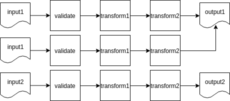

> "Come, let us make bricks, and burn them thoroughly."
>
> &#x2013; legendary builders

You may have noticed by 2020 that data is eating the world.

And whenever any reasonable amount of data needs processing, a complicated multi-stage data processing pipeline will be involved. Why the complexity?

One reason is that real-life data is messy: most of the information we receive comes in dirty, non-validated, non-structured forms. In addition to validation issues, data consumers typically want data presented in a way that is easily understood…

At [Bumble](https://thebeehive.bumble.com/careers) - the parent company operating Badoo and Bumble apps - we apply hundreds of data transforming steps while processing our data sources: a high volume of user-generated events, production databases and external systems. This all adds up to quite a complex system! And just as with any other engineering system, unless carefully maintained, pipelines tend to turn into a house of cards - failing daily, requiring manual data fixes and constant monitoring.

For this reason, I want to share certain good engineering practises with you, ones that make it possible to build scalable data processing pipelines from composable steps. While some engineers understand such rules intuitively, I had to learn them by doing, making mistakes, fixing, sweating and fixing things again…

So behold! I bring you my favourite Rules for Data Processing Pipeline Builders.

# The Rule of Small Steps

This first rule is easy, and to prove its usefulness I've come up with a synthetic example.

Let's say you have data arriving at a single machine with a POSIX-like OS on it.

Each data point is a JSON Object (aka hash table); and those data points are accumulated in large files (aka batches), containing a single JSON Object per line. Every batch file is, say, about 10GB.

First, you want to validate the keys and values of every object; next, apply a couple of transformations to each object; and finally, store a clean result into an output file.

I'd start with a Python script doing everything:

```shell
python transform.py < /input/batch.json > /output/batch.json
```

It can be represented as follows:


In `transform.py` validation takes about 10% of the time, the first transformation takes about 70% of the time and the rest takes 20%.

Now imagine your startup is growing, there are hundreds if not thousands of batches already processed… and then you realise there's a bug in the data processing logic, in its final step, and because of that broken 20%, you'll have to rerun all of it.

The solution is to build pipelines out of the smallest possible steps:

```shell
python validate.py < /input/batch.json > /tmp/validated.json
python transform1.py < /input/batch.json > /tmp/transformed1.json
python transform2.py < /input/batch.json > /output/batch.json
```

The diagram now looks more like a train:


This brings obvious benefits:

-   Steps are easy to understand;

-   Every step can be tested separately;

-   It's easy to cache intermediate results or put broken data aside;

-   The system is easy to extend with error handling;

-   Transformations can be reused in other pipelines.

Thus the Rule of Small Steps.


# The Rule of Atomicity

Let's return to the original example. So, we have some input data and a transformation to apply:

```shell
python transform.py < /input/batch.json > /output/batch.json
```

What happens if your script fails halfway through? The output file will be malformed!

Or worse, the data will only be partially transformed, and further pipeline steps will have no way of knowing that. At the end of the pipe, you’ll only get partial data. Not good.

Ideally, you want the data to be in one of the two states: to-be-transformed or already-transformed. This property is called *atomicity*. An atomic step either happened, or it did not:


In transactional database systems, this can be achieved using - you guessed it - transactions, which make it super easy to compose complex atomic operations on data. So, if you can use such a database - please do so.

POSIX-compatible and POSIX-like file systems have atomic operations (say, `mv` or `ln`), which can be used to imitate transactions:

```shell
python transform.py < /input/batch.json > /output/batch.json.tmp
mv /output/batch.json.tmp /output/batch.json
```

In the example above, broken intermediate data will end up in a \*.tmp file, which can be introspected for debugging purposes, or just garbage collected later.

Notice, by the way, how this integrates nicely with the Rule of Small Steps, as small steps are much easier to make atomic.

There you go! That's our second rule: The Rule of Atomicity.

# The Rule of Idempotence

> In imperative programming, a subroutine with side effects is idempotent if the system state remains the same after one or several calls.
>
> &#x2013; Wikipedia on [Idempotence](https://en.wikipedia.org/wiki/Idempotence#Idempotent_functions)

The Rule of Idempotence is a bit more subtle: running a transformation on the same input data one or more times should give you the same result.

I repeat: you run your step twice on a batch, and the result is the same. You run it 10 times, and the result is still the same. Let's tweak our example to illustrate the idea:

```shell
python transform.py < /input/batch.json > /output/batch1.json
python transform.py < /input/batch.json > /output/batch2.json
diff /input/batch1.json /output/batch2.json
# files are the same
python transform.py < /input/batch.json > /output/batch3.json
diff /input/batch2.json /output/batch3.json
# no changes still
```

We had our `/input/batch.json` as input, it ended up in `/output/batch.json` as output. And no matter how many times we apply the transformation - we should end up with the same output data:



So, unless `transform.py` secretly depends on some kind of implicit input, our `transform.py` step is idempotent (kind of restartable).

Note that implicit input can sneak through in very unexpected ways. If you’ve ever heard
of [reproducible builds](https://en.wikipedia.org/wiki/Reproducible_builds), then you know
the usual suspects: time, file system paths and other flavours of hidden global state.

Why is idempotency important? Firstly for its ease of use! This feature makes it easy to reload subsets of data whenever something was tweaked in `transform.py`, or data in `/input/batch.json`. Your data will end up in the same paths, database tables or table partitions, etc.

Also, ease of use means having to fix and reload a month of data will not be too daunting.

Remember, though, that some things simply cannot be idempotent by definition, e.g. it's meaningless to be idempotent when you flush an external buffer. But those cases should still be pretty isolated, Small™ and Atomic™.

# The Rule of Redundancy

One more thing: delay deleting intermediate data for as long as possible. I'd also suggest having slow, cheap storage for raw incoming data, if possible:


A basic code example:

```shell
python transform1.py < /input/batch.json > /tmp/batch-1.json
python transform2.py < /input/batch-1.json > /tmp/batch-2.json
python transform3.py < /input/batch-2.json > /tmp/batch-3.json
cp /tmp/batch-3.json /output/batch.json.tmp # not atomic!
mv /output/batch.json.tmp /output/batch.json # atomic
```

So, you should keep raw data in `batch.json` and clean data in `output/batch.json` for as long as possible, and `batch-1.json`, `batch-2.json`, `batch-3.json` at least until the pipeline finishes a work cycle.

You'll thank me when analysts decide to change to the algorithm for calculating some kind of derived metric in `transform3.py` and there will be months of data to fix.

So, this is how the Rule of Data Redundancy sounds: redundant data redundancy is your best redundant friend.

# Conclusion

So yes, those are my favourite little rules:

-   split your pipeline into isolated and testable Smallest Steps;

-   strive to make the steps both Atomic and Idempotent;

-   introduce as much data Redundancy as reasonably possible.

This is how we process our data here at Bumble. The data goes through hundreds of carefully crafted, tiny step transformations, 99% of which are Atomic, Small and Idempotent. We can afford plenty of Redundancy as we use cold data storage, hot data storage and even superhot intermediate data cache.

In retrospect, the Rules might feel very natural, almost obvious. You might even sort of follow them intuitively. But understanding the reasoning behind them does help to identify their *applicability limits*, and to step over them if necessary.

Do any other Rules come to your mind?
